# Diagramas de Flujo - EventHub

Este documento describe los principales flujos de procesos de la aplicación EventHub utilizando PlantUML para una representación visual clara y mantenible.

## 1. Flujo de Registro e Inicio de Sesión

### 1.1 Flujo de Registro de Usuario

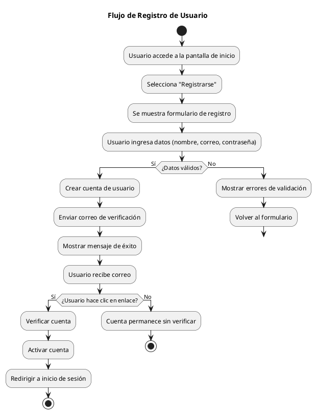

### 1.2 Flujo de Inicio de Sesión

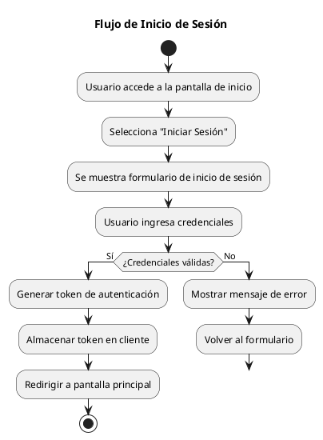

### 1.3 Flujo de Restablecimiento de Contraseña

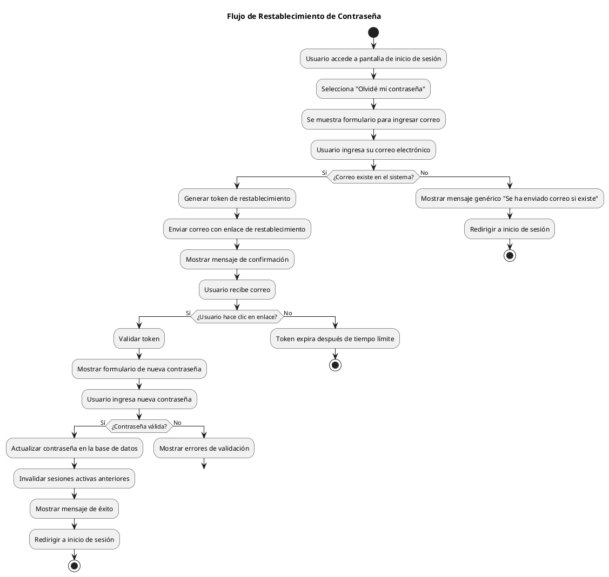

## 2. Flujo de Gestión de Eventos

### 2.1 Flujo de Creación de Evento

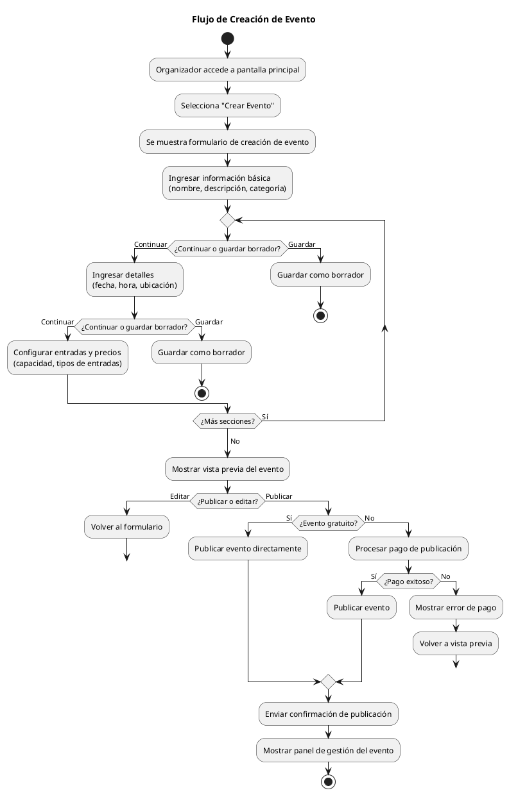

### 2.2 Flujo de Edición de Evento

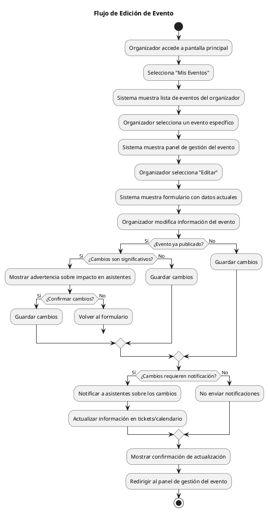

### 2.3 Flujo de Cancelación de Evento

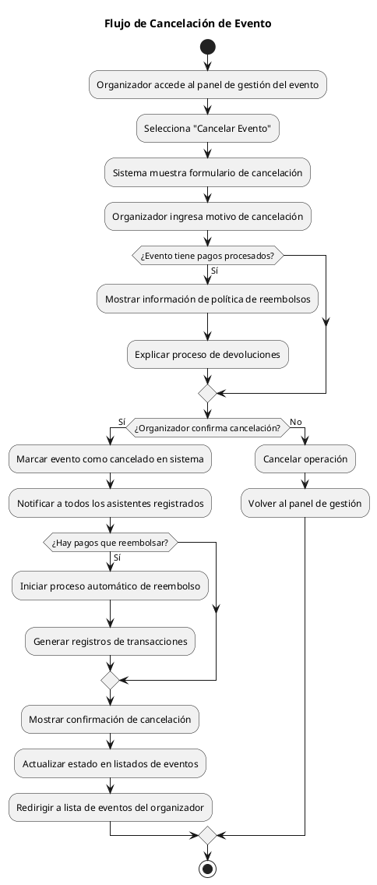

## 3. Flujo de Búsqueda y Asistencia

### 3.1 Flujo de Búsqueda de Eventos

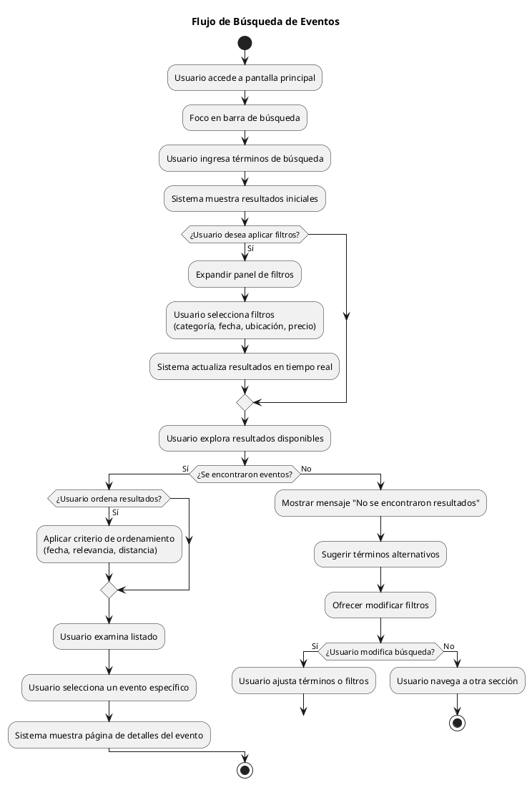

### 3.2 Flujo de Registro de Asistencia

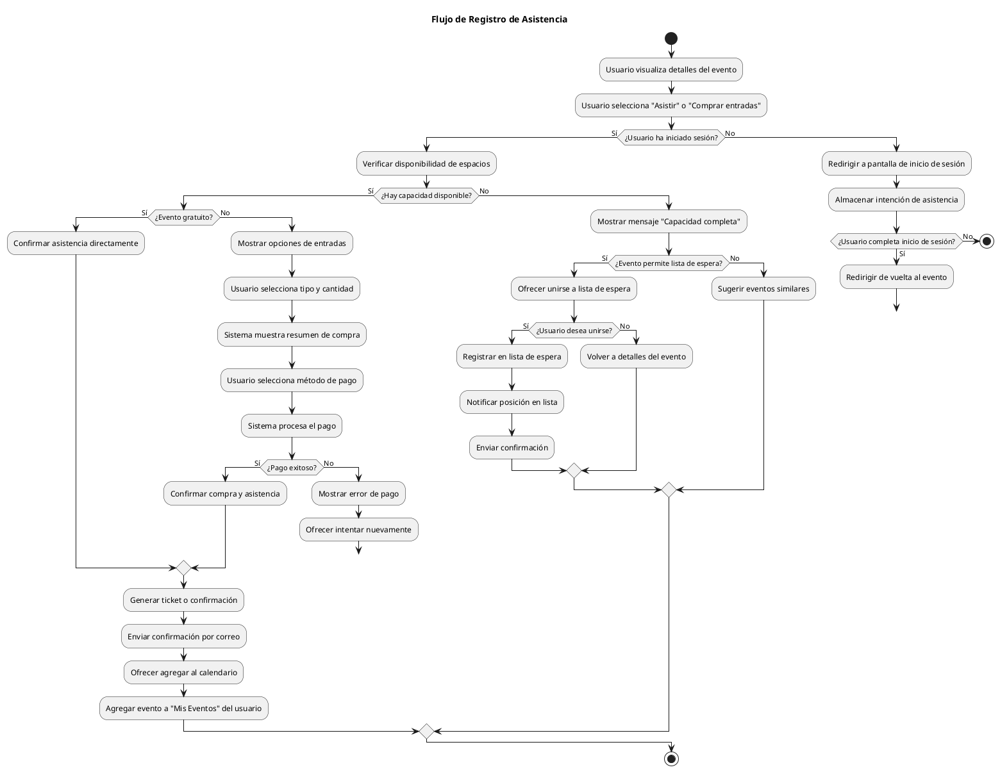

## 4. Flujo de Interacción Social

### 4.1 Flujo de Comentarios en Eventos

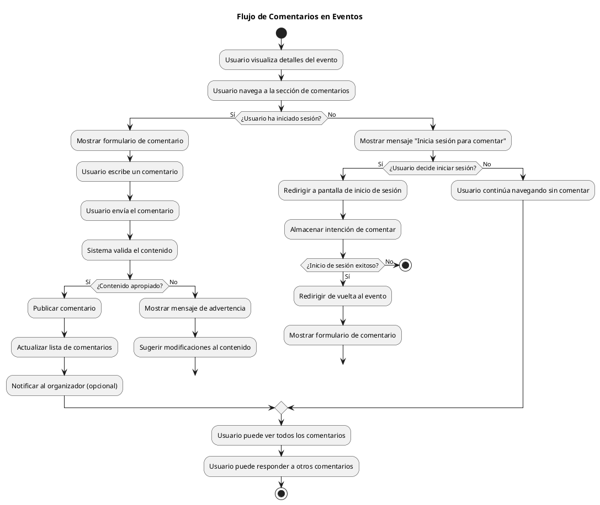

### 4.2 Flujo de Creación de Grupo de Asistentes

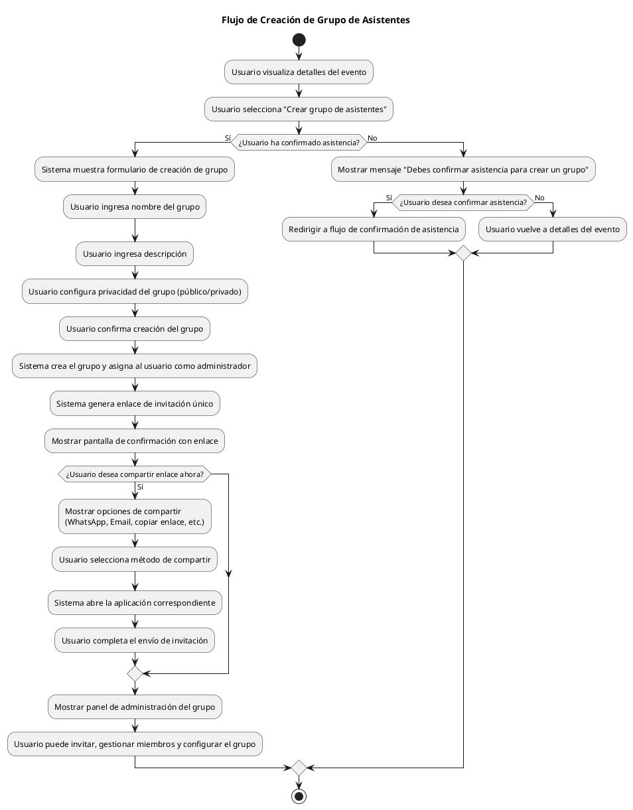

## 5. Flujo de Evaluación y Estadísticas

### 5.1 Flujo de Evaluación Post-Evento

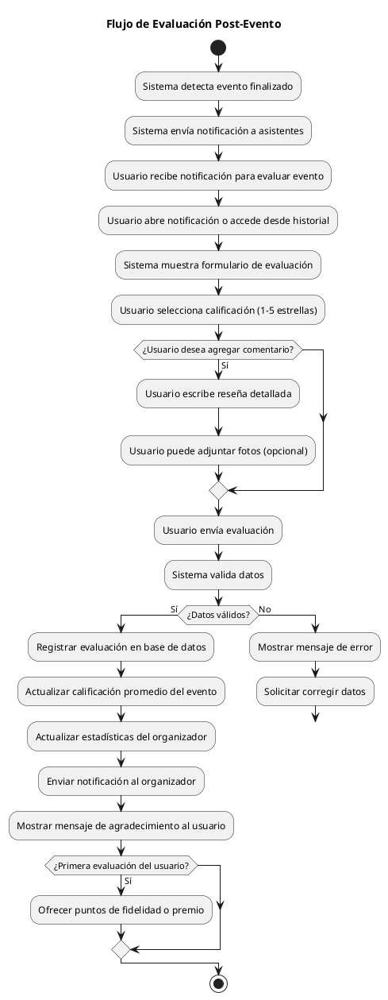

### 5.2 Flujo de Visualización de Estadísticas

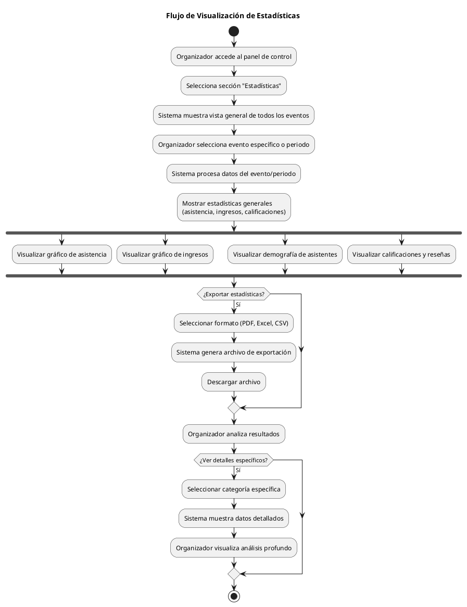

## 6. Flujo de Pagos y Transacciones

### 6.1 Flujo de Procesamiento de Pagos

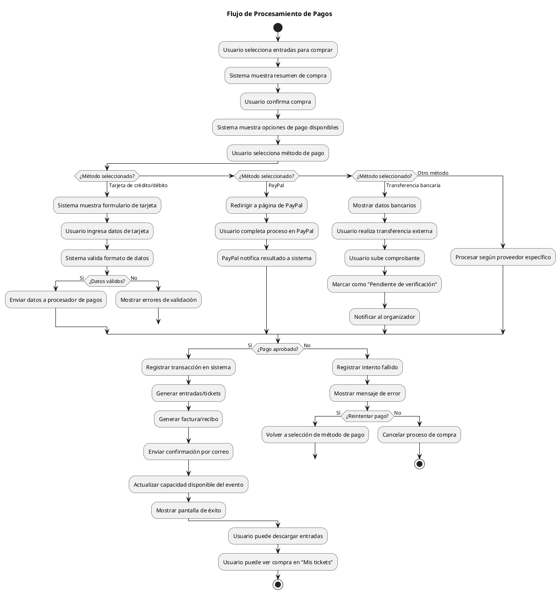

### 6.2 Flujo de Gestión de Membresías

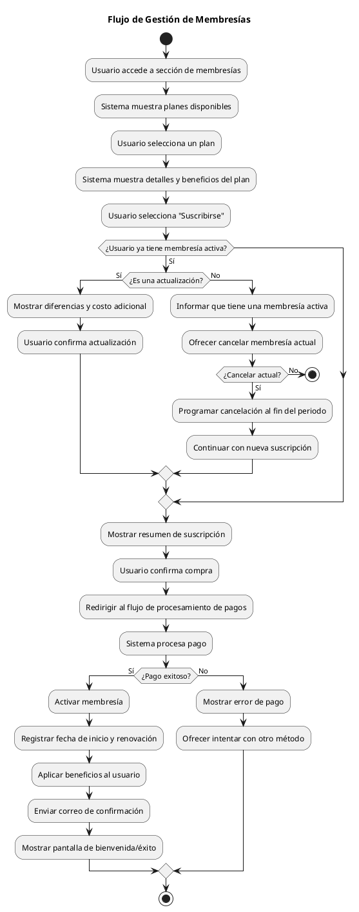

## 7. Flujo de Administración del Sistema

### 7.1 Flujo de Moderación de Contenido

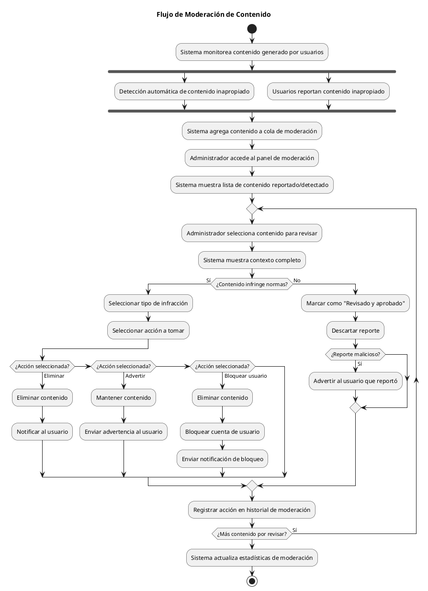

### 7.2 Flujo de Configuración del Sistema

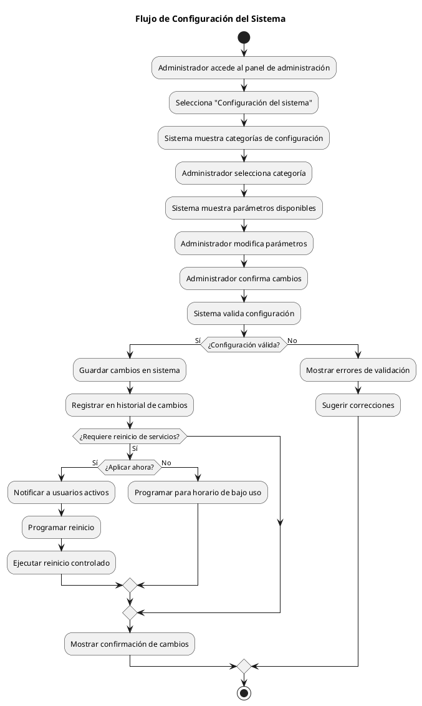