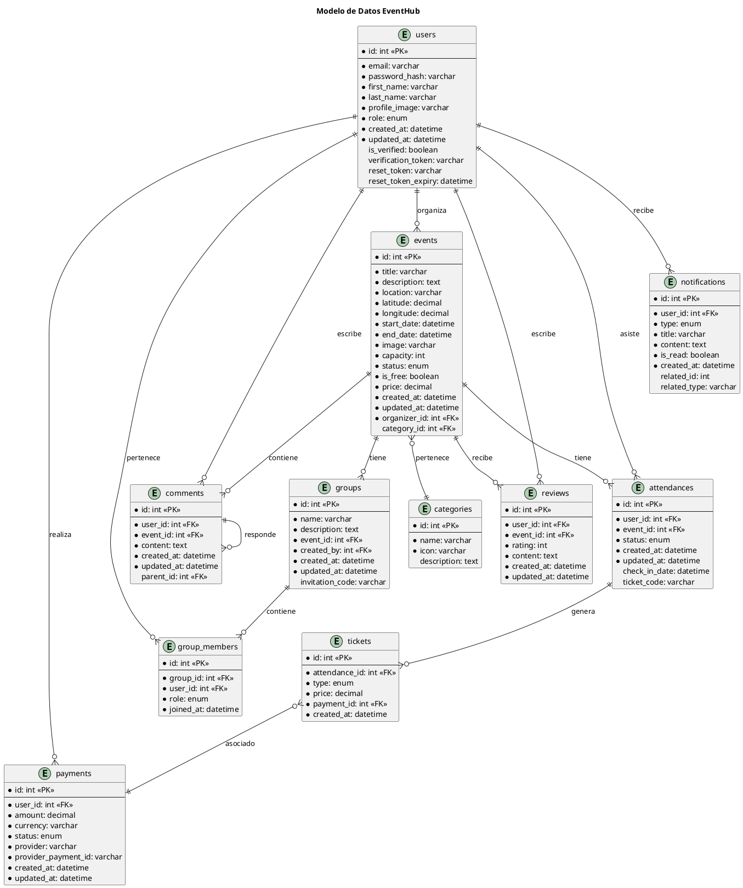
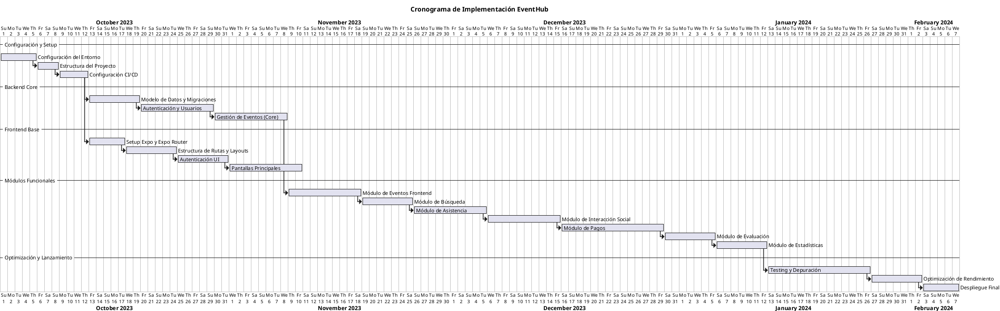
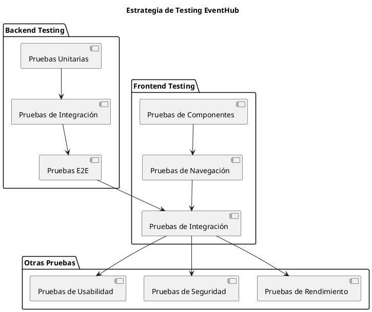

# Plan de Implementación Técnica - EventHub

Este documento detalla el plan de implementación técnica para el desarrollo del sistema EventHub, estableciendo las fases, tecnologías, cronograma y estructura del proyecto.

## 1. Stack Tecnológico

```plantuml
@startuml Stack_Tecnologico
title Stack Tecnológico EventHub

package "Frontend" {
  [React Native / Expo] as Frontend
  [Redux / Context API] as Estado
  [Expo Router] as Navegacion
}

package "Backend" {
  [NestJS] as Backend
  [TypeORM] as ORM
  [Passport JWT] as Auth
  [Jest] as Testing
}

database "Base de Datos" {
  [MySQL] as DB
}

cloud "Servicios Cloud" {
  [AWS S3 / Cloudinary] as Storage
  [Stripe] as Pagos
  [SendGrid / Nodemailer] as Email
  [Firebase Cloud Messaging] as Notificaciones
}

package "DevOps" {
  [Docker] as Contenedores
  [Bitbucket Pipelines] as CI
  [AWS / Vercel] as Hosting
}

Frontend --> Backend : API REST
Estado --> Frontend : Gestión de estado
Navegacion --> Frontend : Navegación basada en archivos
Backend --> DB : Persistencia
Backend --> Storage : Almacenamiento
Backend --> Pagos : Procesamiento pagos
Backend --> Email : Envío correos
Backend --> Notificaciones : Push notifications
Contenedores --> Backend : Contenerización
CI --> Contenedores : Integración continua
Hosting --> CI : Despliegue

@enduml
```

### 1.1 Tecnologías Frontend
- **Framework principal**: React Native con Expo
- **Gestión de estado**: Redux o Context API según complejidad
- **Navegación**: Expo Router (navegación basada en archivos)
- **UI/UX**: Styled Components, React Native Paper
- **Testing**: Jest, React Testing Library
- **Otras librerías**:
  - React Native Reanimated (animaciones)
  - Formik + Yup (validación de formularios)
  - Axios (peticiones HTTP)
  - Dayjs (manejo de fechas)

### 1.2 Tecnologías Backend
- **Framework principal**: NestJS
- **ORM**: TypeORM con MySQL
- **Autenticación**: Passport JWT
- **Validación**: Class Validator
- **Testing**: Jest
- **Documentación API**: Swagger
- **Otras librerías**:
  - Nodemailer/SendGrid (envío de correos)
  - Multer (manejo de archivos)
  - Stripe (procesamiento de pagos)

### 1.3 Base de Datos
- **Motor**: MySQL 8.0
- **Herramientas**: MySQL Workbench, TypeORM Migration
- **Respaldo**: Backups automatizados diarios

### 1.4 DevOps
- **Control de versiones**: Git + Bitbucket
- **CI/CD**: Bitbucket Pipelines
- **Contenedorización**: Docker + Docker Compose
- **Hosting**:
  - Backend: AWS EC2 o similar
  - Frontend: Expo EAS / App Stores
  - Base de datos: AWS RDS o similar
- **Monitoreo**: AWS CloudWatch, Sentry

## 2. Estructura del Proyecto

El proyecto EventHub se ha estructurado como un monorepo usando Yarn Workspaces, lo que permite compartir código entre el frontend y el backend, especialmente las definiciones de tipos.

```
EventHub/
├── packages/                      # Directorio de paquetes del monorepo
│   ├── eventhub-shared/           # Tipos y modelos compartidos
│   │   ├── src/                   # Código fuente
│   │   │   ├── types/             # Definiciones de tipos
│   │   │   │   ├── entities/      # Entidades de dominio
│   │   │   │   ├── dtos/          # DTOs para API
│   │   │   │   └── enums/         # Enumeraciones
│   │   │   └── index.ts           # Punto de entrada y exportaciones
│   │   ├── package.json           # Configuración del paquete
│   │   └── tsconfig.json          # Configuración de TypeScript
│   │
│   ├── eventhub-api/              # Backend (NestJS con Clean Architecture)
│   │   ├── src/
│   │   │   ├── domain/            # Capa de dominio
│   │   │   ├── application/       # Capa de aplicación
│   │   │   ├── infrastructure/    # Capa de infraestructura
│   │   │   └── presentation/      # Capa de presentación
│   │   └── package.json           # Configuración del backend
│   │
│   └── eventhub-mobile/           # Frontend móvil (React Native/Expo)
│       ├── app/                   # Estructura de Expo Router
│       ├── src/                   # Código fuente
│       └── package.json           # Configuración del frontend móvil
│
├── docs/                          # Documentación
│   ├── architecture/              # Documentos de arquitectura
│   ├── requirements/              # Requisitos y documentación funcional
│   ├── technical/                 # Documentación técnica
│   └── user/                      # Documentación para usuarios
│
├── package.json                   # Configuración del monorepo
└── bitbucket-pipelines.yml        # Configuración de CI/CD
```

### 2.1 Backend (NestJS con Clean Architecture)

```
eventhub-api/
├── src/
│   ├── app.module.ts                # Módulo principal
│   ├── main.ts                      # Punto de entrada
│   ├── domain/                      # Capa de dominio
│   │   ├── entities/                # Entidades de dominio (modelos anémicos)
│   │   │   ├── user.entity.ts
│   │   │   ├── event.entity.ts
│   │   │   └── ...
│   │   ├── repositories/            # Interfaces de repositorios
│   │   │   ├── user.repository.ts
│   │   │   ├── event.repository.ts
│   │   │   └── ...
│   │   ├── value-objects/           # Objetos de valor
│   │   ├── enums/                   # Enumeraciones
│   │   └── exceptions/              # Excepciones de dominio
│   │
│   ├── application/                 # Capa de aplicación
│   │   ├── dtos/                    # DTOs (entrada/salida)
│   │   ├── mappers/                 # Mapeadores entre entidades y DTOs
│   │   ├── services/                # Servicios de aplicación
│   │   │   ├── users/
│   │   │   ├── events/
│   │   │   └── ...
│   │   ├── commands/                # Comandos (CQRS)
│   │   │   ├── users/
│   │   │   ├── events/
│   │   │   └── ...
│   │   ├── queries/                 # Consultas (CQRS)
│   │   │   ├── users/
│   │   │   ├── events/
│   │   │   └── ...
│   │   └── interfaces/              # Interfaces para servicios
│   │
│   ├── infrastructure/              # Capa de infraestructura
│   │   ├── config/                  # Configuración
│   │   │   ├── app.config.ts
│   │   │   ├── database.config.ts
│   │   │   └── jwt.config.ts
│   │   ├── persistence/             # Persistencia de datos
│   │   │   ├── typeorm/             # Implementación con TypeORM
│   │   │   │   ├── entities/        # Entidades TypeORM
│   │   │   │   ├── repositories/    # Implementaciones de repositorios
│   │   │   │   └── migrations/      # Migraciones
│   │   │   └── seeds/               # Seeders
│   │   ├── external-services/       # Servicios externos
│   │   │   ├── stripe/              # Servicio de pagos
│   │   │   ├── sendgrid/            # Servicio de emails
│   │   │   └── aws-s3/              # Almacenamiento de archivos
│   │   └── security/                # Seguridad
│   │       ├── jwt.strategy.ts
│   │       └── guards/
│   │
│   ├── presentation/                # Capa de presentación
│   │   ├── controllers/             # Controladores REST
│   │   │   ├── users.controller.ts
│   │   │   ├── events.controller.ts
│   │   │   └── ...
│   │   ├── middlewares/             # Middlewares
│   │   ├── filters/                 # Filtros de excepción
│   │   └── interceptors/            # Interceptores
│   │
│   └── shared/                      # Utilidades compartidas
│       ├── utils/                   # Funciones utilitarias
│       ├── constants/               # Constantes
│       ├── decorators/              # Decoradores personalizados
│       └── pipes/                   # Pipes personalizados
│
├── test/                            # Tests
│   ├── unit/                        # Pruebas unitarias
│   ├── integration/                 # Pruebas de integración
│   └── e2e/                         # Pruebas end-to-end
│
├── Dockerfile                       # Configuración de Docker
├── docker-compose.yml               # Configuración de servicios Docker
├── nest-cli.json                    # Configuración de NestJS
└── package.json                     # Dependencias
```

### 2.2 Frontend (React Native/Expo con Expo Router)

```
eventhub-mobile/
├── App.js                      # Punto de entrada (mínimo, delega a Expo Router)
├── app.json                    # Configuración de Expo
├── app/                        # Directorio especial para Expo Router
│   ├── _layout.js              # Layout raíz
│   ├── index.js                # Pantalla inicial (/)
│   ├── (auth)/                 # Grupo de autenticación
│   │   ├── _layout.js          # Layout para autenticación
│   │   ├── login.js            # Pantalla de login (/login)
│   │   ├── register.js         # Pantalla de registro (/register)
│   │   └── recover.js          # Recuperación de contraseña (/recover)
│   ├── (tabs)/                 # Grupo de pestañas principales 
│   │   ├── _layout.js          # Layout de pestañas
│   │   ├── home.js             # Pestaña Home (/home)
│   │   ├── search.js           # Pestaña Búsqueda (/search)
│   │   ├── profile.js          # Pestaña Perfil (/profile)
│   │   └── notifications.js    # Pestaña Notificaciones (/notifications)
│   ├── events/                 # Rutas para eventos
│   │   ├── _layout.js          # Layout para sección eventos
│   │   ├── index.js            # Lista de eventos (/events)
│   │   ├── [id].js             # Detalle de evento (/events/123)
│   │   ├── create.js           # Crear evento (/events/create)
│   │   └── edit/[id].js        # Editar evento (/events/edit/123)
│   ├── attendees/              # Rutas para asistencia
│   │   ├── index.js            # Lista de asistencias (/attendees)
│   │   └── [eventId].js        # Asistentes de un evento (/attendees/123)
│   ├── payments/               # Rutas para pagos
│   │   ├── checkout/[eventId].js # Checkout (/payments/checkout/123)
│   │   └── success.js          # Pago exitoso (/payments/success)
│   ├── social/                 # Rutas para interacción social
│   │   ├── comments/[eventId].js # Comentarios (/social/comments/123)
│   │   └── groups/[eventId].js # Grupos (/social/groups/123)
│   └── +not-found.js           # Página 404
├── src/
│   ├── components/             # Componentes reutilizables
│   │   ├── common/             # Componentes genéricos
│   │   ├── events/             # Componentes relacionados con eventos
│   │   └── profile/            # Componentes de perfil
│   ├── context/                # Context API / Redux
│   │   ├── auth/               # Contexto de autenticación
│   │   ├── events/             # Contexto de eventos
│   │   └── app/                # Contexto general de la app
│   ├── services/               # Servicios de API
│   │   ├── api.js              # Configuración base de axios
│   │   ├── auth.service.js     # Servicios de autenticación
│   │   └── events.service.js   # Servicios de eventos
│   ├── utils/                  # Utilidades
│   │   ├── formatters.js       # Formateadores (fechas, monedas, etc.)
│   │   ├── validators.js       # Validadores
│   │   └── storage.js          # Manejo de almacenamiento local
│   └── constants/              # Constantes
│       ├── colors.js           # Colores de la aplicación
│       ├── layout.js           # Constantes de layout
│       └── api.js              # Constantes de API
├── assets/                     # Imágenes, fuentes, etc.
├── metro.config.js             # Configuración de Metro para monorepo
└── package.json                # Dependencias
```

### 2.3 Paquete Compartido (Tipos)

```
eventhub-shared/
├── src/
│   ├── types/
│   │   ├── entities/           # Entidades de dominio
│   │   │   ├── User.ts
│   │   │   ├── Event.ts
│   │   │   ├── Category.ts
│   │   │   └── ...
│   │   ├── dtos/               # DTOs para transferencia de datos
│   │   │   ├── auth/           # DTOs relacionados con autenticación
│   │   │   ├── events/         # DTOs relacionados con eventos
│   │   │   └── ...
│   │   ├── enums/              # Enumeraciones compartidas
│   │   │   ├── UserRole.ts
│   │   │   ├── EventStatus.ts
│   │   │   └── ...
│   │   └── interfaces/         # Interfaces compartidas
│   │       ├── repositories/   # Interfaces de repositorios
│   │       └── services/       # Interfaces de servicios
│   └── index.ts                # Punto de entrada y exportaciones
├── dist/                       # Distribución compilada
├── package.json                # Configuración del paquete
└── tsconfig.json               # Configuración de TypeScript
```

#### 2.3.1 Compartiendo Tipos entre Frontend y Backend

En este proyecto, utilizamos un enfoque de monorepo para compartir definiciones de tipos entre frontend y backend, lo que asegura la coherencia y proporciona verificación de tipos en tiempo de compilación.

**Ventajas:**
- Single source of truth para nuestras entidades y DTOs
- Detección temprana de errores al cambiar la estructura de datos
- Mejor DX (Developer Experience) con autocompletado en IDE
- Documentación implícita de la API

**Uso en el backend:**
```typescript
// En NestJS usamos los tipos compartidos
import { User, UserRole } from 'eventhub-shared';

@Injectable()
export class UserService {
  async findById(id: number): Promise<User> {
    // Implementación...
  }
}
```

**Uso en el frontend:**
```typescript
// En Expo utilizamos los mismos tipos
import { Event, EventStatus } from 'eventhub-shared';

const EventCard = ({ event }: { event: Event }) => {
  // Implementación...
};
```

Esta estructura garantiza que tanto el frontend como el backend trabajen con las mismas definiciones de tipos, reduciendo errores y facilitando el mantenimiento.

## 3. Modelo de Datos



## 4. Cronograma de Implementación

### 4.1 Visión General (Gantt)



### 4.2 Implementación por Sprints

Basado en sprints de 2 semanas:

| Sprint | Fechas Estimadas | Objetivos |
|--------|------------------|-----------|
| **Sprint 1** | 01/10 - 14/10 | Configuración del entorno, estructura del proyecto, CI/CD |
| **Sprint 2** | 15/10 - 28/10 | Modelo de datos, migraciones, backend de autenticación |
| **Sprint 3** | 29/10 - 11/11 | Backend de eventos (core), setup de Expo con Expo Router |
| **Sprint 4** | 12/11 - 25/11 | Estructura de rutas y layouts, autenticación frontend |
| **Sprint 5** | 26/11 - 09/12 | Pantallas principales, módulo de eventos frontend |
| **Sprint 6** | 10/12 - 23/12 | Módulo de búsqueda, inicio del módulo de asistencia |
| **Sprint 7** | 24/12 - 06/01 | Finalización del módulo de asistencia, interacción social |
| **Sprint 8** | 07/01 - 20/01 | Interacción social, inicio de módulo de pagos |
| **Sprint 9** | 21/01 - 03/02 | Finalización del módulo de pagos |
| **Sprint 10** | 04/02 - 17/02 | Módulo de evaluación, estadísticas |
| **Sprint 11** | 18/02 - 03/03 | Testing integral, depuración |
| **Sprint 12** | 04/03 - 17/03 | Optimización de rendimiento, preparativos finales |
| **Sprint 13** | 18/03 - 31/03 | Despliegue final, lanzamiento, monitoreo |

### 4.3 Historias de Usuario por Sprint

#### Sprint 1-2: Configuración y Autenticación
- Configurar entorno de desarrollo
- Estructurar proyectos backend y frontend móvil
- Configurar CI/CD con Bitbucket Pipelines
- Implementar modelo de datos y migraciones
- Desarrollar backend de autenticación (registro, login, recuperación)

#### Sprint 3-5: Eventos y Frontend Básico
- Implementar CRUD de eventos en backend
- Configurar frontend con Expo y Expo Router
- Implementar estructura de rutas y layouts
- Desarrollar pantallas de autenticación
- Crear pantallas principales de visualización de eventos

#### Sprint 6-7: Búsqueda y Asistencia
- Implementar sistema de búsqueda de eventos
- Desarrollar filtros de búsqueda
- Implementar registro de asistencia
- Desarrollar sistema de tickets
- Implementar códigos QR para entradas

#### Sprint 8-9: Interacción Social y Pagos
- Desarrollar sistema de comentarios
- Implementar grupos de asistentes
- Integrar sistema de pagos (Stripe)
- Desarrollar flujo de compra de entradas
- Implementar gestión de transacciones

#### Sprint 10: Evaluación y Estadísticas
- Implementar sistema de evaluación post-evento
- Desarrollar dashboard de estadísticas
- Crear informes para organizadores

#### Sprint 11-13: Finalización y Lanzamiento
- Testing exhaustivo
- Optimización de rendimiento
- Preparación para producción
- Despliegue final
- Monitoreo post-lanzamiento

## 5. Plan de Pruebas

### 5.1 Estrategia de Testing



### 5.2 Tipos de Pruebas

1. **Pruebas Unitarias**:
   - Backend: Servicios, controladores, pipes, guards
   - Frontend: Componentes individuales, hooks, utilidades

2. **Pruebas de Integración**:
   - Backend: Flujos completos de API, interacción con base de datos
   - Frontend: Interacción entre pantallas y componentes

3. **Pruebas End-to-End**:
   - Flujos completos de usuario (registro, login, creación de eventos, etc.)

4. **Pruebas de Rendimiento**:
   - Carga y estrés en API
   - Rendimiento de aplicación móvil

5. **Pruebas de Seguridad**:
   - Vulnerabilidades en API
   - Validación de autenticación y autorización

## 6. Plan de Despliegue

### 6.1 Infraestructura

```plantuml
@startuml Infraestructura
title Infraestructura de Despliegue EventHub

cloud "AWS" {
  [EC2 Instance] as EC2
  database "RDS MySQL" as RDS
  [S3 Bucket] as S3
  [CloudFront] as CF
  [Route 53] as R53
  [ELB] as LB
}

cloud "Firebase" {
  [Cloud Messaging] as FCM
}

cloud "Stripe" {
  [Payment API] as Stripe
}

cloud "Apple/Google" {
  [App Store] as AppStore
  [Play Store] as PlayStore
}

actor "Usuario Mobile" as UserMobile
actor "Usuario Web" as UserWeb
actor "Administrador" as Admin

UserMobile --> AppStore
UserMobile --> PlayStore
AppStore --> FCM
PlayStore --> FCM
UserMobile --> R53
UserWeb --> R53
R53 --> LB
LB --> EC2
EC2 --> RDS
EC2 --> S3
S3 --> CF
EC2 --> FCM
EC2 --> Stripe
Admin --> EC2

@enduml
```

### 6.2 Proceso de Despliegue

1. **Entorno de Desarrollo**:
   - Despliegue local con Docker
   - Base de datos MySQL local

2. **Entorno de Staging**:
   - Despliegue automático desde main branch
   - Base de datos RDS de prueba
   - Servicios en modo sandbox

3. **Entorno de Producción**:
   - Despliegue manual aprobado
   - Base de datos RDS de producción
   - Servicios en modo producción

### 6.3 Estrategia de Migración de Datos

1. **Migraciones de Base de Datos**:
   - Uso de TypeORM Migrations
   - Scripts de migración versionados
   - Estrategia de rollback para cada migración

2. **Datos Iniciales**:
   - Seeders para datos de configuración
   - Datos de prueba para entorno de desarrollo

## 7. Equipo y Roles

| Rol | Responsabilidades | Cantidad |
|-----|-------------------|----------|
| **Gerente de Proyecto** | Supervisión general, comunicación con stakeholders | 1 |
| **Arquitecto Tech Lead** | Diseño de arquitectura, decisiones técnicas | 1 |
| **Desarrolladores Backend** | Implementación de API y servicios | 2 |
| **Desarrolladores Frontend Móvil** | Implementación de UI y experiencia de usuario móvil | 2 |
| **DevOps** | Configuración CI/CD, infraestructura, monitoreo | 1 |
| **QA** | Testing, automatización de pruebas | 1 |
| **Diseñador UI/UX** | Diseño de interfaces, experiencia de usuario | 1 |

## 8. Riesgos y Mitigación

| Riesgo | Impacto | Probabilidad | Estrategia de Mitigación |
|--------|---------|--------------|--------------------------|
| Retrasos en desarrollo | Alto | Medio | Sprints bien planificados, comunicación frecuente |
| Problemas de integración frontend-backend | Medio | Medio | Definir API clara desde el inicio, pruebas de integración tempranas |
| Problemas de rendimiento con base de datos | Alto | Bajo | Revisiones de diseño de BD, indexación adecuada, pruebas de carga |
| Complejidad en sistema de pagos | Alto | Medio | Implementación por fases, pruebas exhaustivas, documentación clara |
| Rechazos en App Stores | Alto | Bajo | Seguir guidelines estrictamente, pruebas en dispositivos reales, revisión anticipada |

## 9. Criterios de Finalización

Para considerar el proyecto completado, se deben cumplir los siguientes criterios:

1. **Funcionalidad Completa**:
   - Todos los módulos implementados según especificaciones
   - API completa y documentada con Swagger
   - Frontend con todas las pantallas y flujos

2. **Calidad**:
   - Cobertura de pruebas > 80%
   - No hay errores críticos ni de seguridad
   - Rendimiento aceptable (tiempos de respuesta < 3s)

3. **Despliegue**:
   - Ambiente de producción configurado y operativo
   - Monitoreo establecido
   - Documentación de operación y mantenimiento

4. **Entregables Finales**:
   - Código fuente en repositorio Bitbucket
   - Documentación técnica
   - Manual de usuario
   - Aplicación publicada en App Stores 